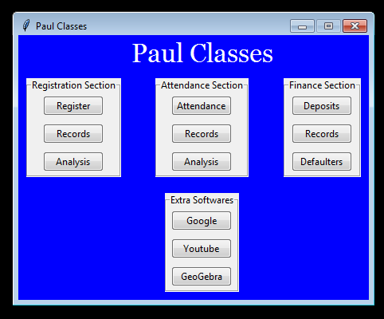

# Tuition-Management-Software

## Description

This repository contains the software that would manage the general activities/works of a tuition.

## How Does A Tuition Works?

There are many activities that tuition management involves , which can be automated . Here are the lists of processess that tuition management involves:

### Registration Section

* Register names of new commers
* Access the records of students , class.
* Analyse the trend of pattern in which students are joining tuition in order to make better descisions.

### Attendance Section

* Take the attendance of students of all classes.
* Study the attendance records of all students in order to catch students with very low attendances.

### Finance Section

* This would include knowing the names of students who have not paid monthly/yearly fees.
* This would also include making separate tabular records of the fees paid/dues of all students.
* This would also include the study of the income which is being generated by the tuition teacher so that he/she can get lots of insight on this area of tuition management.

### Pattern In Which Fees Is Required To Be Deposited

* Many tuitions are there which would ask students to give some fees every month.
* Tuitions may also ask students to give some particualar amount of fees in a year instead of asking for monthly fees submition.

## Why Am I Intrested To Work On Such A Project?

I , being a tuition going student and son of a tuition teacher , have seen the hardships involved in the proper management of tuitions. I saw that usually all these works require approx 3-4hrs which can be automated and be done in just seconds.

## Knowledge Required

This project would be requiring just the knowledge of tkinter, python, pandas, matplotlib in order to understand and contribute.

## Setting Up This Project In PC

1. Firstly clone this repository.
1. Now, in folder named Tuition_Management_Software, run Main_Window python file.

## Procedure To Contribute

Firstly , a big thankyou from my side , if you are wishing to help me out. To contribute to this project , just clone repository, read [Structure.md](Tuition_Management_Software/Structure.md) start and making your changes in a new branch. Make a pull request and I would get your contribution.

## Discussion Forum

I have also set a discussion forum in order enable frequent sharing of ideas, suggestions in this project. Click [here](https://github.com/Sam-Varghese/Tuition-Management-Software/discussions) to land up at discussion forum of this repo , and please feel free to start discussions.

