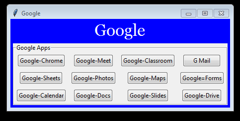
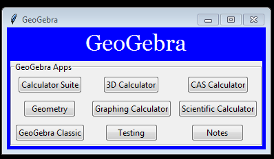

# Extra_Softwares

This file contains description of all file included in folder named Extra_Softwares. SO is all the information:

1 Firstly , the main aim of making a folder like this is to make such programs that would be like shortcuts to programs like google, youtube, [geogebra](https://www.geogebra.org/?lang=en)( Used for scientific calculations and geometry) .This is required to be made because as a teacher my father says that every time he has to start a new class , he would open google , search for google meet , click first option , then would he come to a page from where he can start a new class. So I thought to make simple button that would land my father directly on that required page. Example has been shown below:

 

 

2 So as it is evident is above image , to make this window , this folder contains file named [Google.py](Google.py) which would have buttons to open up all google apps.

3 Then there is a file named [GeoGebra.py](GeoGebra.py) . The main purpose of this file is to put buttons for geogebra apps.
 

 