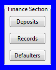
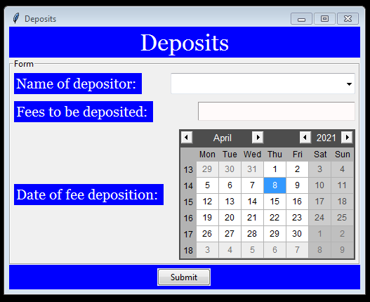

# Finance Section

This file contains all information about files included in finance section. So here is all the information: 

1 There is a file named [Deposits.py](Deposits.py) . The main function of this file is to accept names of all fee depositors.

2 After it is possible to record names of fee depositors with the help of [Deposits.py](Deposits.py) , now comes the file [Records.py](Records.py) whose main function would be to let the administrator see the fee deposit history.

