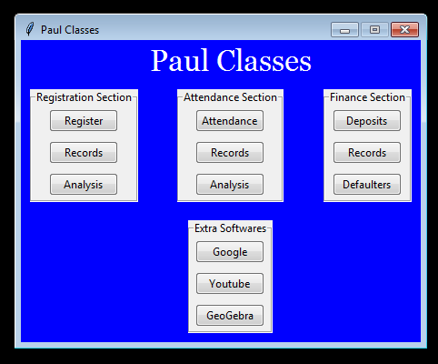

# Tuition_Management_Software Folder

Respected sir/mam, this is a file containing information of all things that have been included in this folder named *Tuition_Management_Software*. So here is all the information:

1. Firstly a file named [Classes.py](Classes.py) has been included which contains all the necessary classes for making tkinter widgets. So making any change in any widget here would change the styles of all widgets throughout the program.

2. Secondly , a file named [Main_Window.py](Main_Window.py) has been made , which contains code for main window of this project.

4. Now , after all this, a folder named **Registration_Section** is also there whose main purpose is to combine all the python files that would enable registration and also analysis of registered names.
5. I would also be adding more folders in future for finance section , attendance section etc.  