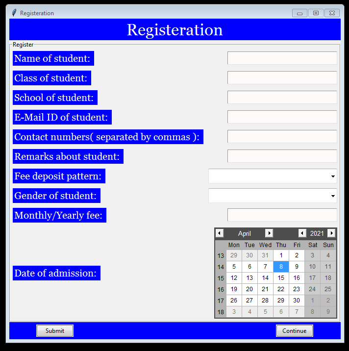
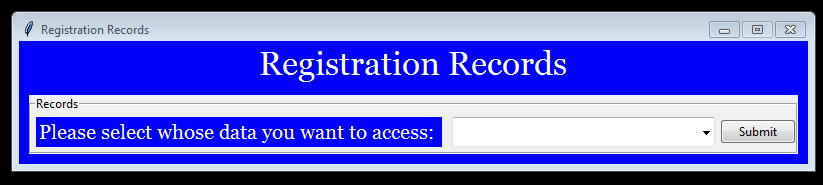
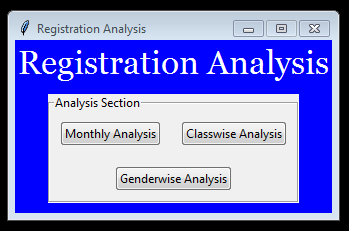

# Registration Section

Respected sir/mam , this file is just the introduction of what all things have been covered in the folder named Registration_Section , whose path is *Tuition_Management/Registration_Section*. So here is all the information:-

1. Firstly , in this folder a file named [Register.py](Register.py) has been made whose main function would be make a window that would ask for details of student to get his name registered in tuition.

2. I was in a confusion of wether I should make program assign ID Numbers for each student , but then I decided not to give ID numbers and rather let the names of every student be unique( if students with same name also appear , then let the teacher put 1,2,3 after name so as to make it unique). This is because most tuitions (in India) dont make ID cards for each student due to which students wont remember his ID number and the teacher would also have to open up excel to look onto the ID number of students which would become very tiring job.
3. As mentioned in the README.md of this repository, that a teacher can ask for monthly / yearly fee (ie to deposit fees every month , or give whole fees at any time , but in that present year only) , hence i have also made a combobox in [Register.py](Register.py) which would ask for the type of fee deposit pattern that the student has to follow.
   
1. Secondly , after the name has been registered by the program [Register.py](Register.py) , now comes [Records.py](Records.py) whose main function would be to enable the administrator to look onto the classwise/studentwise records which were taken while registration process.

2. Thirdly , after name has been registered by [Register.py](Register.py) and the administrator is also able to get all information of students through [Records.py](Records.py) , now comes the [Analysis.py](Analysis.py) whose main function would be to give insight to the administrator of when and how many students are joining every month , ratio of students in respective classes and male to female ratio of every class , so that the administrator can come to know about all such important facts.
