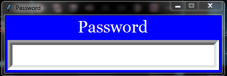

# Security_Section

This file contains information about the files included under Security_Section:

1 A file named [Password_Entry.py](Password_Entry.py) has been made which contains program to do security checks.

2 The security checks involved till yet includes password filling which has no submit button as its contents are checked every second by a separate python thread.

